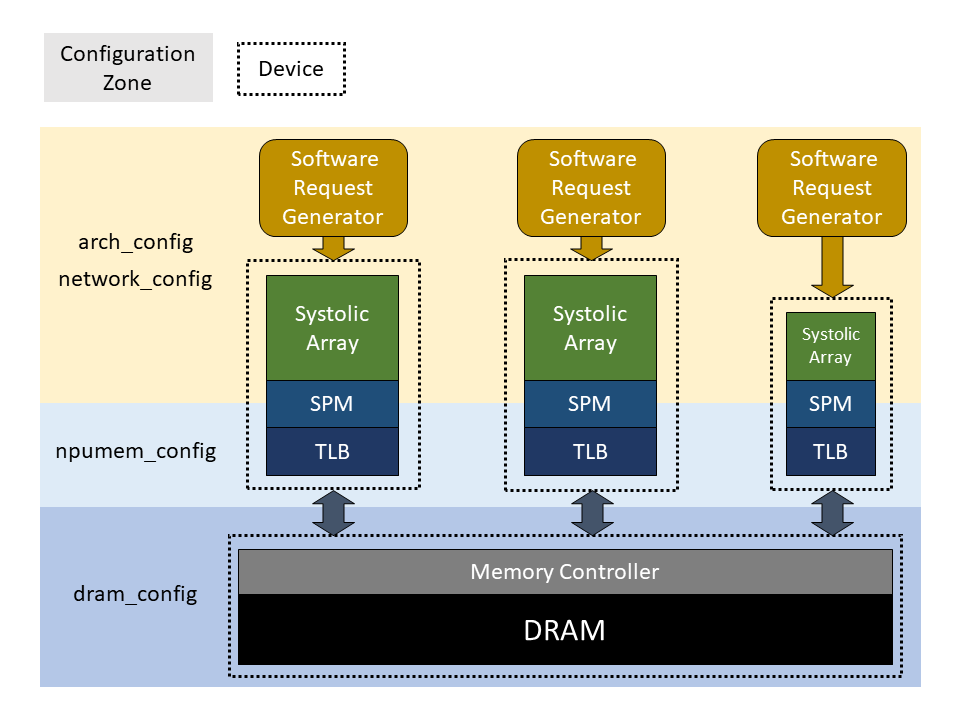

# mNPUsim: A Cycle-accurate Multi-core NPU simulator

## Simulator Outline
mNPUsim is a cycle-accurate simulator modeling NPU system with off-chip memory.


## Getting Started
```bash
# Load DRAMsim3 as a submodule
git submodule update --init --recursive

# Create shared library
cd DRAMsim3
make libdramsim3.so
cd ..

# Run test
make
make single_test1
```

## Options (Set in common.h)
* SRAM_TRACE: Generates the SRAM trace in result_path/intermediate/(sram files). If SRAM_TRACE=false, only cycle is computed. (default: false)
* DRAMREQ_NPU_TRACE: Option for the dramreq trace in npu-side cycle. (default: false)
* DEBUG: Debug option. (default: false)

## Parameters
As shown in Makefile, it requires six parameters: 1) core architecture, 2) target network, 3) target dram, 4) npumem config, 5) result path, and 6) misc config.
Each configuration has list of single configuration files and result path is for output directory.

## Results
* dramsim_output: The access information of dram, tlb, and pagetable walkers. When the dram req sent, the start-cycle is written in dram.log and the end-cycle is written in dramreq.log.
* intermediate_config: Reconstructed configuration. Unlike original network file, it considers the GEMM translation (e.g the im2col-out convolution), absolute address translation.
* intermediate: The intermediate results except the memory constraints. Based on this intermediate result, our simulator generates the memory requests. The format of output line is (cycle), (list of address). Therefore, only first value (cycle) is remained when SRAM_TRACE is false.
* result: Several summary files: 1) Average cycles, 2) the size of memory footprint, 3) per layer execution cycle, and 4) PE utilization.

## Publication
mNPUsim: Evaluating the Effect of Sharing Resources in Multi-core NPUs (IISWC 2023)
